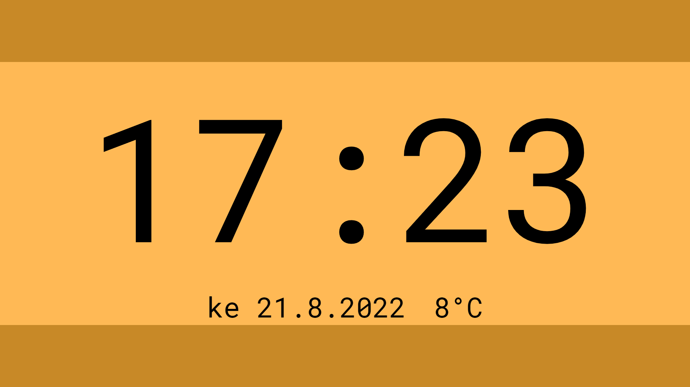

# Pajascreen

Simple fullscreen webpage for workplace displays to show clock, date, and outside temperature.

## Elements
- Frontend
	- Clock
	- Date
	- Weather
	- WebSocket Client
- Backend
	- HTTP Server
	- OpenWeatherMap Client
	- WebSocket Server

## Configuration
**.env** file containing values for `OPENWEATHERMAP_API_KEY` and `PAJASCREEN_PORT` fields.

## Screenshot

## TODO
- [ ] Change hardcoded location coordinates to be dynamic via configuration file
- [ ] Add functionality to change color palette according to season
- [ ] Change fallback font to a monospace one